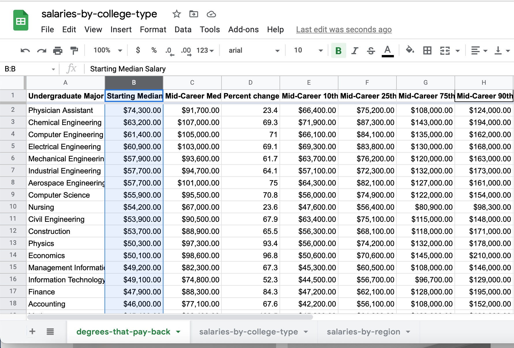

# J124 Final Project: Data Analysis & Visualization of Where it Pays to Attend College
## By Layal Younan
### Data Analysis Process
* Download the “Where it Pays to Attend College” [data sheets](https://www.kaggle.com/wsj/college-salaries) as .csv files, upload it to Google Drive, and open it with Google Sheets.  

*The following are five questions and step-by-step answers based on the data sets:*  
 

**Question 1: _Which undergraduate majors has the highest percent change from starting to mid-career (median) salary, and which has the lowest? Include the percent change amount._**  

**Step-by-step answer:**
1. Sort the column "Percent change from Starting to Mid-Career Salary" in the "degrees-that-pay-back" data sheet from Z->A (or greatest to smallest) to find the highest percent change from starting to mid-career (median) salary, like so:  

* **As shown, math and philosophy have the highest percent change from starting to mid-career (median) salary with a 103.5% change.**
2. Unsort the column now.
3. Sort the column "Percent change from Starting to Mid-Career Salary" in the "degrees-that-pay-back" data sheet from A->Z (or smallest to greatest) to find the lowest percent change of starting to mid-career (median) salary, like so:  

* **As shown, physician assistant has the lowest percent change from starting to mid-career (median) salary with a 23.4% change.**  
 

**Question 2: _Of the schools that had data, which three schools have the highest percent change from mid-career 10th percentile to mid-career 90th percentile? Include the percent change amount._**  

**Step-by-step answer:**
1. Create a filter on the "salaries-by-region" data set. On the column "Mid-Career 10th Percentile Salary" filter out "N/A" in order to only see the schools that have data.
2. Title the first empty column, which is the ninth column, "Percent change from mid-career 10th to 90th percentile" and bold it.
3. In the new column, "Percent change from mid-career 10th to 90th percentile," subtract the "Mid-Career 10th Percentile Salary" column from the "Mid-Careeer 90th Percentile Salary" column, then divide that by the "Mid-Career 10th Percentile Salary" column and multiply it by 100, or hit the percent symbol to automatically do so. This will give you the percent change.
4. The data set should appear as so:
!['Percent Change from Mid-Career 10th to 90th Percentile in "Salaries-by-Region" Data Set','A Google Sheet representing the mid-career 10th percentile in the "Mid-Career 10th Percentile Salary" column and the mid-career 90th percentile in the "Mid-Career 90th Percentile Salary" column. A filter has been applied to remove all of the "N/A"s in the "Mid-Career 10th Percentile Salary" column. The "Percent change from mid-career 10th to 90th percentile" column is presented to illustrate that change in salary from 10th to 90th percentile. The values as percentages and formula are shown in the picture.'](Screenshot-percentchange-10-90.jpg)
5. Sort the "Percent change from mid-career 10th to 90th percentile" column from Z->A (or greatest to smallest) to find the highest percent change from mid-career 10th to 90th percentile, like so:  
!['Highest Percent Change from Mid-Career 10th to 90th Percentile in "Salaries-by-Region" Data Set','A Google Sheet representing the mid-career 10th percentile in the "Mid-Career 10th Percentile Salary" column, the mid-career 90th percentile in the "Mid-Career 90th Percentile Salary" column, and the percent change from mid-career 10th to 90th percentile in the "Percent change from mid-career 10th to 90th percentile" column. The "Percent change from mid-career 10th to 90th percentile" column was sorted from highest to lowest to find the top three schools with the highest percent change from mid-career 10th to 90th percentile. Yale University, State University of New York (SUNY) at Fredonia, and Harvard University were the top three, with 462.07%, 451.83%, and 425.55% change, respectively.'](Screenshot-highest-10-90.jpg)
* **As shown, Yale University, State University of New York (SUNY) at Fredonia, and Harvard University have the highest percent change from mid-career 10th to 90th percentile, with 462.07%, 451.83%, and 425.55%, respectively.**  
 

**Question 3: _Which five undergraduate majors have the highest percent change from mid-career 10th percentile to mid-career 90th percentile? Include the percent change amount._**  

**Step-by-step answer:**
1. On the "degrees-that-pay-back" data set, title the first empty column "Percent change from mid-career 10th to 90th percentile" and bold it.
2. In the new column, "Percent change from mid-career 10th to 90th percentile," subtract the "Mid-Career 10th Percentile Salary" column from the "Mid-Careeer 90th Percentile Salary" column, then divide that by the "Mid-Career 10th Percentile Salary" column and multiply it by 100, or hit the percent symbol to automatically do so to find the percent change. 
3. The data set should appear as so:

4. Sort the "Percent change from mid-career 10th to 90th percentile" column from Z->A (or greatest to smallest) to find the highest percent change from mid-career 10th to 90th percentile, like so:  
!['Highest Percent Change from Mid-Career 10th to 90th Percentile in "Degrees-that-Pay-Back" Data Set','A Google Sheet representing the mid-career 10th percentile in the "Mid-Career 10th Percentile Salary" column, the mid-career 90th percentile in the "Mid-Career 90th Percentile Salary" column, and the percent change from mid-career 10th to 90th percentile in the "Percent change from mid-career 10th to 90th percentile" column. The "Percent change from mid-career 10th to 90th percentile" column was sorted from highest to lowest to find the top five undergraduate majors with the highest percent change from mid-career 10th to 90th percentile. Music, philosophy, art history, drama, and marketing were the top five, with 401.87%, 373.24%, 334.03%, 316.89%, and 315.68% change, respectively.'](Screenshot-highest-major-10-90.jpg)
* **As shown, music, philosophy, art history, drama, and marketing have the highest percent change from mid-career 10th to 90th percentile, with 401.87%, 373.24%, 334.03%, 316.89%, and 315.68%, respectively.**  
 

**Question 4: _What are the average starting median salaries for each region?_**  

**Step-by-step answer:**
1. On the "salaries-by-region" data set, create a pivot table.
2. On the pivot table, set the row to "Region" and add the average of "Starting Median Salary" as the value in order to observe the average starting median salaries for each region. It should appear as so:

* **As shown, the average starting median salary is $51,032.14 for California, $44,225.35 for Midwestern, $48,496.00 for Northeastern, $44,521.52 for Southern, and $44,414.29 for Western.**  
 

**Question 5: _How many schools in each region have a mid-career median salary greater than or equal to $100,000?_**  

**Step-by-step answer:**
1. On the "salaries-by-region" data set, create a pivot table.
2. On the pivot table, set the row to "Region" and add the count of "School Name" as the value. Set a filter for "Mid-Career Median Salary" to be values greater than or equal to $100,000. This is so we find how many schools in each region have a mid-career median salary greater than or equal to $100,000.

* **As shown, California has 9 schools, Midwestern has 3 schools, Northeastern has 26 schools, Southern has 8 schools, and Western has 1 school with a mid-career median salary greater than or equal to $100,000.**  
 

**Question 6: _Which undergraduate major has the highest starting median salary? Which has the highest mid-career median salary? Include the amount._**  

**Step-by-step answer:**
1. On the "degrees-that-pay-back" data set, sort the "Starting Median Salary" column from Z->A (or greatest to smallest) to find the highest starting median salary, like so:

* **Ass shown, physician assistant has the highest starting median salary with $74,300.**
2. Unsort the column now.
3. Sort the "Mid-Career Median Salary" column from Z->A (or greatest to smallest) to find the highest mid-career median salary, like so:
!['name','alt'](

### Story Summary and Sourcing
